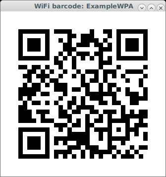

# wifi2qr

[](https://www.gnu.org/licenses/gpl-3.0)

A simple `bash` script to share your computer's WiFi connection settings
[via QR code](https://github.com/zxing/zxing/wiki/Barcode-Contents#wifi-network-config-android).

Requires the command-line utility
[`nmcli` from NetworkManager](https://developer.gnome.org/NetworkManager/stable/nmcli.html)—plus
[`qrencode`](https://fukuchi.org/works/qrencode/) and
[ImageMagick's `display`](https://www.imagemagick.org/script/display.php) in order to actually
display the barcode.

## Installation and usage

```sh
$ curl https://raw.githubusercontent.com/dlenski/wifi2qr/HEAD/wifi2qr > ~/bin/wifi2qr
$ chmod +x !$
$ wifi2qr
```

… which will display a barcode that you can read with your smartphone to connect to the
network. Tested with Android's `zxing`-based
[Barcode Scanner](https://play.google.com/store/apps/details?id=com.google.zxing.client.android).



You can also share a specific connection, by its NetworkManager
connection name or UUID with `wifi2qr CONNECTION`.
(You can list known WiFi connections with `wifi2qr -l`.)

### Complete options

```
wifi2qr [-h] [-l] [-u | -a] [connection]

Displays a QR code that can be scanned to connect to a WiFi network
known to NetworkManager.

Options:
  connection    Show QR code for specific connection (if not
                specified, currently-enabled WiFi connection)
  -h            Show this help message
  -l            List WiFi connections known to NetworkManager
  -a | -i       Show QR code using ANSI characters or with ImageMagick
                (default is to show using UTF8 characters)
  -q            Quiet mode (default is to print barcode in text
                form to stderr as well; this suppresses it)
```
